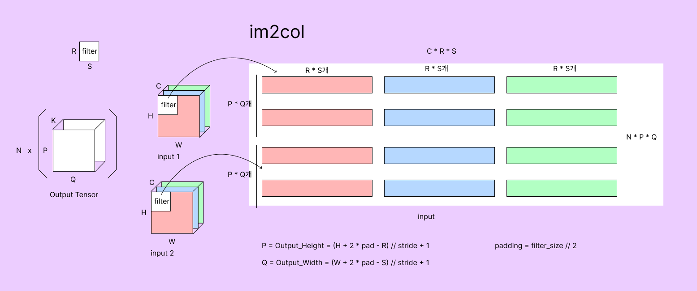
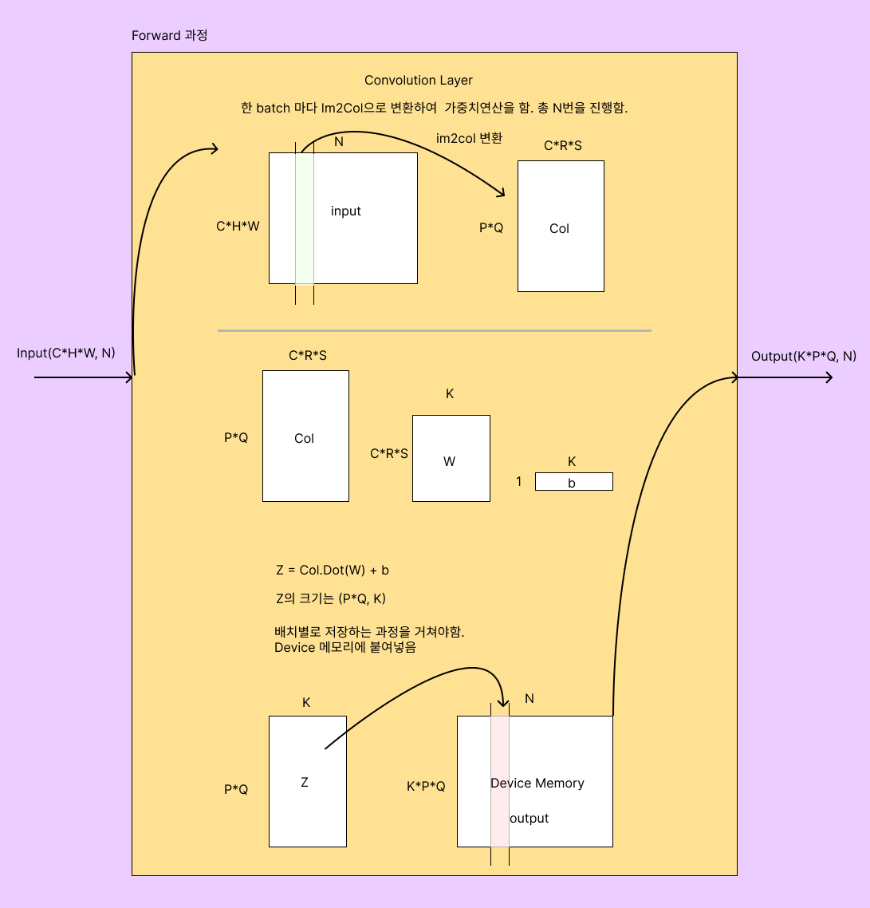
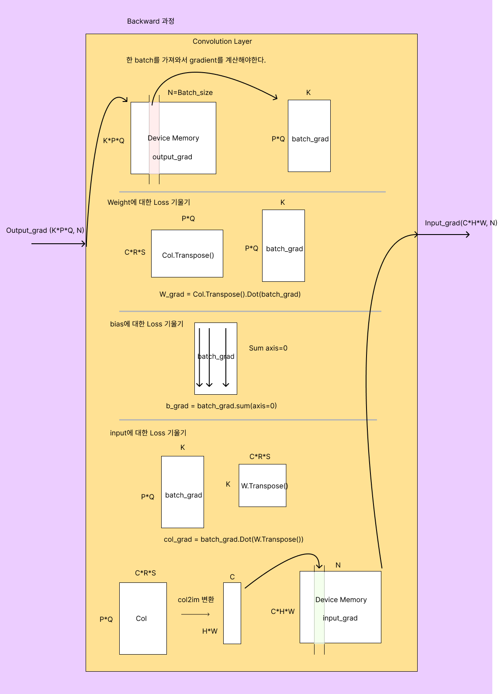

# Convolution Layer

**합성곱 계층(Convolution Layer)**은 입력 데이터에 대해 필터(커널)를 적용하여 특징 맵을 생성한다. Convolution Layer는 이미지 처리를 비롯해 다양한 컴퓨터 비전 작업에 사용된다.


## Padding

합성곱 연산의 결과가 입력보다 크기가 작아지는 문제를 피하려면, 출력의 크기와 입력의 크기와 일치시키도록 데이터 주변에 추가적인 값들을 채우는 과정을 말한다. 


## Pooling

풀링은 공간적인 크기를 줄이는 연산이다. 주로 최대풀링(Max Pooling)과 평균 풀링(Average Pooling)이 사용된다.

풀링의 이점은 계산량 감소에 있다. 이미지를 다운샘플링해서 픽셀 데이터수를 줄여 계산량을 줄인다.

신경망에 여러개의 풀링층이 배치된다면 계산이득도 중첩된다. 하지만 이미지에서 줄어든 픽셀 수 만큼 정보도 손실된다.

최근에는풀링사용은 최소한으로 줄이거나 아예 사용하지 말라고 한다.


## Stride

풀링은 특징맵은 다운샘플링하여 계산량을 줄이지만, 데이터 손실때문에 잘 사용하지 않는다. 그것의 대책으로 Stride를 조절하는 방법이 있다.

Stride는 보폭이라는 의미로 생각하면된다. 필터를 적용할 때 이동하는 간격을 의미한다. Stride 값은 필터를 입력 데이터에 적용하는 단계마다 몇 칸씩  이동할지를 결정한다.


## 합성곱 연산

합성곱 층에서 다루는 데이터는 전결합층 데이터와는 다르게 4차원 데이터이다. (Batch, Channel, Height, Width)순으로 입력이 주어진다. 거기에 (in_channel, out_channel, filter_width, filter_height)의 필터를 거쳐야하는 연산이 필요하다.

아래는 다채널 2차원 합성곱의 연산과정이다.  

```python
# forward
for c_in in range(in_channels):
    for c_out in range(out_channels):
        for o_w in range(img_size):
            for o_h in range(img_size):
                for p_w in range(param_size):
                    for p_h in range(param_size):
                        out[c_out][o_w][o_h] += \
                            param[c_in][c_out][p_w][p_h]
                                * pad[c_in][o_w + p_w][o_h + p_h]
                                
# get grad
for i in range(inp.shape[0]):
    for c_in in range(in_channels):
        for c_out in range(out_channels):
            for o_w in range(img_size):
                for o_h in range(img_size):
                    for p_w in range(param_size):
                        for p_h in range(param_size):
                            param_grad[c_in][c_out][p_w][p_h] += \
                            	inp_pad[i][c_in][o_w + p+w][o_h + p_h] *
                                output_grad[i][c_out][o_w][o_h]
```

for문이 6겹과 7겹으로 되어있기 때문에 속도가 매우느리다. 합성곱의 신경망의 이해를하기 위해 연산을 구현했지만 더 나은 방법이 존재한다.


## Im2Col & Col2Im

### Im2Col

**Im2Col (Image to Column)**은 입력 데이터를 필터의 크기와 padding/stride에 맞게 행렬을 2차원으로 재구성하는 과정이다. 이렇게 변환된 행렬과 가중치를 연산하면 합성곱 연산을 훨씬 효율적으로 수행할 수 있다.




N: batch, C: channels, H: Height, W: width, 

P: Output_Height, Q: Output_Width, 

R: Filter_Height, S: Filter_Width

(N, C, H, W), (R, S) => (N * P * Q, C * R * S)


```python
channels = 3
height = 5
width = 7

stride = 1
padding = 1
filter_size = 3
```

입력데이터가 (channels, height, width) = (3, 5, 7) 크기의 데이터로 주어진다.

```python
height_col = (height + 2 * padding - filter_size) // stride + 1
width_col = (width + 2 * padding - filter_size) // stride + 1
```

결과의 크기는 (height_col * width_col, filter_size * filter_size * channels) = (35, 27)로 주어질것이다.


Cuda로 구현한 코드는 아래 git 링크에서확인할 수 있다.

(git link)


### Forward




### Col2Im

Im2Col은 입력 이미지를 필터의 크기에 맞게 재구성하여 2차원 행렬로 변환하는 과정이라면 그 반대가 Col2Im이다. 역전파과정에서 2차원 기울기행렬을 이미지데이터 형태로 변환할때 사용한다.





## 실습

