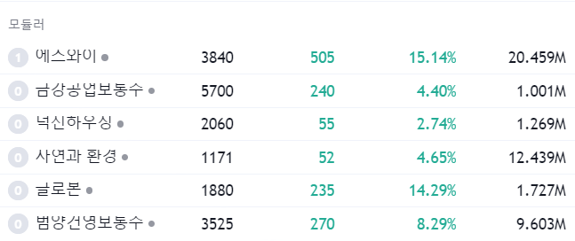

# 23-05-22 월

[속보] '전세사기 특별법' 국토위 소위 통과 [https://n.news.naver.com/mnews/article/001/0013956114?rc=N&ntype=RANKING&sid=001](https://n.news.naver.com/mnews/article/001/0013956114?rc=N&ntype=RANKING&sid=001)

* 리파인

젤렌스키 손잡은 尹대통령 "韓기업, 우크라 재건 도울 것" [https://v.daum.net/v/20230521174206413](https://v.daum.net/v/20230521174206413) 

* 디알텍 퍼스텍 서희건설 오텍 웰크론 한컴라이프케어

'슈퍼 엘니뇨' 등장에 커피 가격도 껑충…12년 만에 최고치 [https://news.mt.co.kr/mtview.php?no=2023051909203237324](https://news.mt.co.kr/mtview.php?no=2023051909203237324) 

* 한국맥널티 보라티알

‘디스플레이 전문가’ 이재용, 거침없는 OLED 투자 행보… “슈퍼사이클 대비 완료” [https://n.news.naver.com/article/366/0000903322?sid=105](https://n.news.naver.com/article/366/0000903322?sid=105) 

* HB테크놀로지 신도기연 선익시스템 라온텍 야스 우리이앤엘

에스와이 주담통화 확인. 우크라이나 재건회의 대표이사 참석

