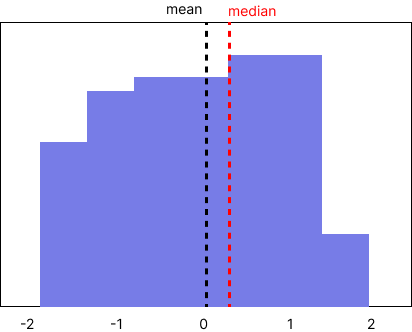
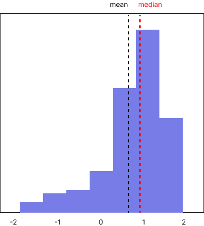

# 히스토그램
{: .fw-700 }

히스토그램은 데이터의 분포를 시각화하는 데 사용되는 그래프다. 데이터를 구간으로 나누고 각 구간에 속하는 데이터의 빈도를 나타낸다. 히스토그램은 x축에는 데이터의 구간(bin), y축에는 해당 구간에 속하는 데이터의 빈도 또는 상대도수를 나타낸다.

히스토그램은 주로 연속적인 데이터의 분포를 파악하는 데 사용된다. 예를 들어, 키, 체중, 온도 등과 같은 연속적인 수치 데이터의 분포를 확인할 때 사용된다. 이를 통해 데이터의 중심 경향성, 분산, 이상치 등을 시각적으로 파악할 수 있다.


## mean, median

### mean

평균(mean)은 데이터의 중심 경향성을 파악하기 위해 사용된다. 특히 히스토그램에서 데이터의 분포가 대체로 대칭적이고 이상치가 없는 경우, 평균은 데이터의 중심 경향성을 잘 반영한다. 평균은 데이터의 전반적인 특징을 나타내지만, 이상치의 영향을 크게 받을 수 있다.



위의 대칭을 이루는 경우에는 mean을 사용하는 것이 적합하다.

```python
# 평균 (Mean)
mean = np.mean(data)
```


### median

중앙값(median)은 데이터의 중앙에 위치한 값이다. 평균과는 반대로 히스토그램에서 데이터의 분포가 비대칭적이거나 이상치가 있는 경우에 사용된다. 중앙값은 데이터를 크기 순서로 정렬했을 때 가운데 위치한 값이다. 따라서 이상치에 영향을 받지 않는다.



위와 같이 데이터가 치우친 경우, 대칭적이지 않은 경우 중앙값을 사용하는것이 적합하다.

```python
# 중앙값 (Median)
median = np.median(data)
```


### Left-skewed, Right-skewed

왼쪽으로 치우친, 오른쪽으로 치우친 이라는 뜻으로, 히스토그램이나 분포그래프에서 데이터의 분포모양을 나타내는 용어다.

* Left-skewed: 데이터가 오른쪽으로 쌓이는 형태. 두 번째 그림처럼
* Right-skewed: 데이터가 왼쪽으로 쌓이는 형태. 비지니스 Right skewed 형태가 많다.