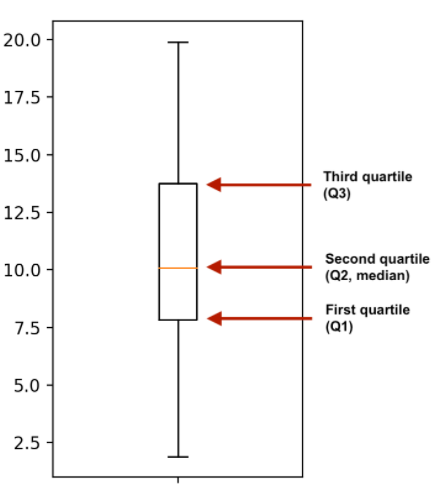
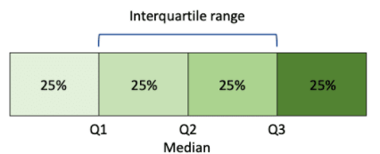
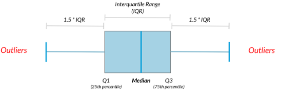

# Spread

통계에서 스프레드는 데이터의 변동이나 분포의 넓이를 나타내는 개념이다. 데이터의 퍼짐 정도를 알려준다. 데이터가 얼마나 떨어져있는지, 얼마나 가깝게 있는지를 설명한다.


## Variance

**분산(Variance)**은 데이터의 퍼짐정도를 측정하는 지표다. 데이터가 **평균**으로부터 얼마나 멀리 흩어져 있는지를 나타낸다. 데이터 포인트와 평균 간의 거리의 제곱의 평균으로 정의된다.

분산의 값이 작을수록 데이터가 평균주변에 모여있고, 값이 클 수록 데이터가 평균에서 멀리 흩어져있다.


```python
np.var(data, ddof=1)
```

* ddof: 델타자유도. N - ddof 이며 N은 요소수를 나타낸다. 디폴트는 0


## Standard deviation

**표준편차(standard deviation)**는 분산의 제곱근을 취하여 계산되는 산포측정 값이다.


표준편차는 **데이터의 스케일**을 나타낸다. 분산은 제곱을하였기 때문에 실제 값에서 멀다. 그래서 제곱근을 취했다. 따라서 표준편차는 데이터의 분포를 직관적으로 이해하기 쉽게한다.

표준편차의 값이 작을수록 데이터가 평균주변에 모여있고, 값이 클 수록 데이터가 평균에서 멀리 흩어져있다.

```python
np.sqrt(np.var(data, ddof=1))
```

또는

```python
np.std(data, ddof=1)
```


## Mean absolute deviation

**평균 절대 편차**는 데이터 포인트와 평균간의 절대적인 거리의 평균을 나타낸다. 분산에서는 제곱을 한것과는 다르게 절댓값을 취한다.


거리차의 제곱을 해 이상치에 대한 영향을 받는 분산과는 다르게 이상치에 대한 영향을 덜 받는다.

```python
means = np.mean(data)
np.mean(np.abs(data - means))
```


## Quantile

**분위수(Quantile)**은 데이터를 동등한 크기로 나눈데 사용되는 개념이다. 일반적으로 가장 잘알려진 분위수는 **사분위수(Quartile)**이다. 사분위수는 데이터를 4개의 동일한 크기로 나눈 것을 말하며, 주로 데이터의 중앙값(Median)과 함께 사용된다.

* 1사분위수 (25th Percentile): 4등분 후 첫 번재 부분
* 2사분위수 (50th Percentile): 데이터의 중앙값
* 3사분위수 (75th Percentile) : 4등분 후 세 번째 부분

사분위수 외에도 다른 분위수도 가능하다. 예를 들어, 10분위수(Cecile)은 데이터를 동일한 크기로 10개로 나눈것이다.

```python
np.quantile(data, 0.5)
```

* 0.5 quantile = median

```python
np.quantile(data, [0, 0.25, 0.5, 0.75, 1])
```

```
>>> array([1.9, 7.85, 10.1, 13.75, 19.9])
```

* 예를들어 데이터의 25%가 1.9 ~ 7.85 사이

```python
np.quantile(data, np.linspace(0, 1, 5))
```

* 동일한 분할간격을 사용하려면 numpy의 linspace를 이용하자


### Box plot



분위수의 box plot은 데이터의 전체적인 분포와 중앙값의 위치, 이상치의 존재여부를 파악하는 데 도움된다.


### Interquartile range (IQR)



**사분위 범위 (IQR)**는 데이터의 상위 25%와 하위 25% 사이의 범위로 정의된다. 사분위범위는 25번째 백분위수와 75번째 백분위 수 사이의 거리이다. 캔들 몸통의 높이이다.

```python
np.quantile(data, 0.75) - np.quantile(data, 0.25)
```

scipy라이브러리를 사용하면 아래와 같이 요약가능하다.

```python
from scipy.stats import iqr
iqr(data)
```


### Outliers



**이상치 또는 특이치(Outlier)**는 데이터 집합에서 다른 값들과 동떨어진 극단적인 값이다. 이상치는 잘못된 측정, 데이터 입력 오류, 자연적인 변동성 등으로 인해 발생할 수 있다.

이상치는 주의해야할 요소 중하나다. 이상치가 포함된 데이터는 평균, 분산 등의 통계량을 왜곡시키고, 모델의 정확도를 낮추는 요인이된다. 따라서 이상치를 탐지하고 처리하는 것이 중요하다.

이상치 탐지에 자주 사용되는 규칙은

* `data < Q1 - 1.5 * IQR`
  * 1사분위수에서 IQR의 1.5배를 뺀 값보다 보다 작은 경우
* `data > Q3 + 1.5 * IQR`
  * 3사분위수보다 큰 IQR의 1.5배를 더한 값보다 큰 경우


```python
from scipy.stats import iqr
iqr = iqr(df['weight'])
lower_threshold = np.quantile(df['weight'], 0.25) - 1.5 * iqr
upper_threshold = np.quantile(df['weight'], 0.75) + 1.5 * iqr
```

상한, 하한 **임계값**을 계산한다. 다음 데이터를 필터링한다.

```python
df[(df['weight'] < lower_threshold) | (df['weight'] > upper_threshold)]
```


describe()를 사용하면 통계량을 요약하여 볼 수 있다.

```python
df['weight'].describe()
```

