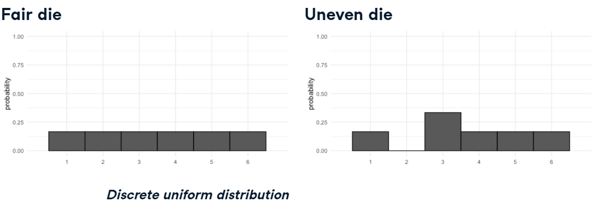
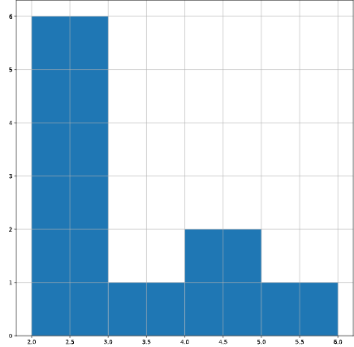
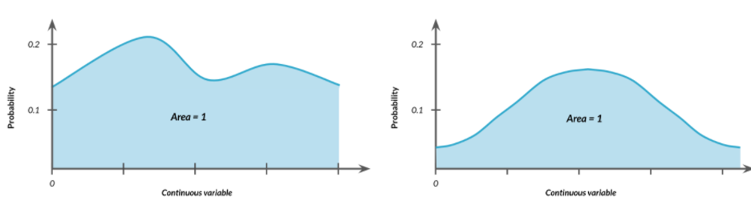
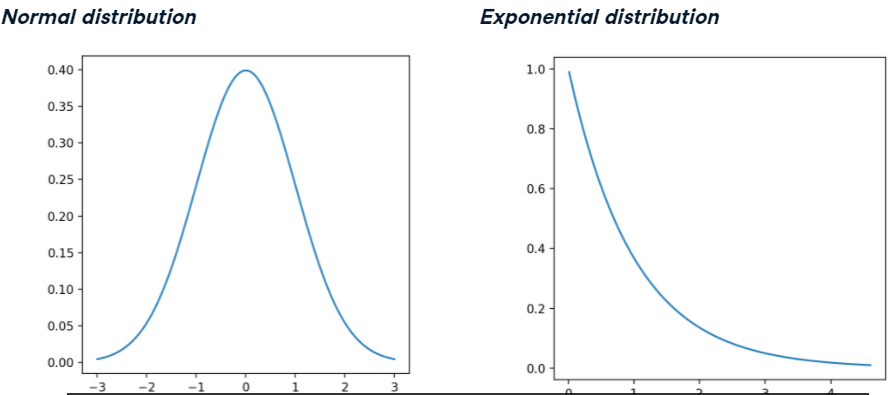
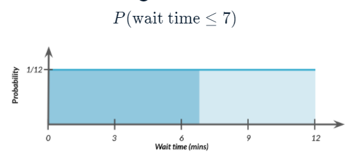

# 확률분포

* 이산분포 (Discrete distribution)
* 연속분포 (Continuous distribution)
* 이항분포 (Binomial distribution)
* 확률분포함수 - scipy


## Discrete distribution

**이산분포**는 시나리오에서 가능한 각 결과의 확률을 설명한다.  이산분포는 확률 변수가 이산적인 값을 가질 때 사용되는 분포다. **이산 변수**는 유한한 값 또는 셀 수 있는 값으로 구성되어 있습니다. 예를들어 주사위 던지기는 1부터 6까지 값 중 하나를 가지므로 이산변수이다.


### 주사위를 돌렸을 때 예상되는 점수는?

```
1 * 1/6 + 2 * 1/6 ... = 3.5
```


### 이상균등분포



동전던지기와 주사위의 경우 각 경우의수는 동일한 확률을 가지므로 이산균등분포라 할 수 있다.


### Law of large numbers

Sample의 크기가 증가하면 Sample 평균이 이론적 평균에 근접한다.


### 이산분포에서 확률 구하기 - scipy 사용 x

size 별로 count하는 데이터 프라임이 존재한다.

```python
restaurant_groups['group_size'].hist(bins=[2, 3, 4, 5, 6])
```



Size의 분포구하기


사이즈별로 count와, size 갯수를 나눠서 평균을 구함.

```python
size_dist = restaurant_groups['group_size'].value_counts() / restaurant_groups.shape[0]
size_dist
```

```
2    0.6
4    0.2
6    0.1
3    0.1
```


column 명을 재지정한다.

```python
size_dist = size_dist.reset_index()
size_dist.columns = ['group_size', 'prob']
```


size의 기댓값 = (size * 확률) 의 합 = 2.9

```python
expected_value = np.sum(size_dist['group_size'] * size_dist['prob'])
expected_value
```

```
2.90000000004
```


size가 4보다 같거나 클 확률은?

```python
groups_4_or_more = size_dist[size_dist['group_size'] >= 4]

# # Sum the probabilities of groups_4_or_more
prob_4_or_more = np.sum(groups_4_or_more['prob'])
prob_4_or_more
```

```
0.300000000004
```

30%임을 확인할 수 있다.


## Continuous distribution

**연속분포**는 확률 변수가 연속적인 값을 가질 때 사용되는 확률 분포이다. **연속변수**는 실수 범위 내에서 어떤 값을 가질 수 있으며, 값 사이에 무수히 많은 값들이 존재한다.

ex) 버스가 30분안으로 올 확률?

연속분포는 다양한 형태를 가진다. 모양에 상관없이 면적은 항상 1이다.




일반적으로 사용되는 연속 분포는 정규분포와 지수분포가 있다.



* **정규 분포 (Normal distribution)**:  종 모양의 대칭적인 분포로, 많은 자연 현상을 잘 모델링하는 분포이다. 평균과 표준 편차에 의해 형태가 결정된다.
* **지수 분포 (Exponential distribution)**: 사건이 일정한 간격으로 발생하는 시간을 모델링하는 분포이다. 주로 사건의 대기 시간이나 수명을 모델링할 때 사용된다.


## Binomial distribution

이항분포는 이산확률 분포의 하나다. 동전 던지기와 같이 앞면과 뒷면의 2가지의 경우의 수일 때 사용한다.

독립적인 베르누이 시행을 n번 반복할 때, 성공하는 횟수를 나타내는 분포이다. 각 시행에서 성공할 확률이 p인 경우에 적용된다.


## 확률분포 함수 - scipy

scipy는 다양한 확률 분포 함수를 제공한다.

* **누적분포함수 - CDF (Cumulative Distribution Function)** - 확률 변수가 특정 값 이하일 확률을 계산하는 함수입다. `cdf()` 함수를 사용하여 주어진 분포의 누적 분포 값을 계산한다. 예를 들어, `norm.cdf(x, loc, scale)`는 정규 분포에서 x 이하의 누적 확률을 계산한다.

  

  버스를 기다린 시간이 7분보다 작을 확률은??

  ```python
  from scipy.stats import uniform
  uniform.cdf(7, 0, 12)
  ```

  7분보다 클 확률은?

  ```python
  1 - uniform.cdf(7, 0, 12)
  ```

* **이산확률함수 - PMF (Probability Mass Function)** - PMF는 이산 확률 분포에서 특정 값의 확률을 계산하는 함수다. `pmf()` 함수를 사용하여 이산 분포의 확률 질량 함수 값을 계산한다. 예를 들어, `binom.pmf(k, n, p)`는 이항 분포에서 k번 성공할 확률을 계산한다.

* **누적분포함수의 역함수 - PPF or Quantile Function** -   `ppf()` 함수를 사용하여 분포의 특정 누적 확률에 해당하는 값을 계산한다. 예를 들어, `expon.ppf(q, loc, scale)`는 지수 분포에서 q에 해당하는 분위수를 계산한다.

* **확률밀도함수 - PDF (Probability Density Function)** - 연속확률분포에서 확률 밀도값을 계산하는 함수다.   `pdf()` 함수를 사용하여 연속 분포의 확률 밀도 함수 값을 계산한다. 예를 들어, `norm.pdf(x, loc, scale)`는 정규 분포에서 x에서의 확률 밀도 값을 계산한다.

* **확률 변수(난수) 생성 - rvs (Random Variates Sampling)** - 주어진 표본에서 무작위 표본을 생성하는 함쉬다. `rvs()` 함수를 사용하여 주어진 분포에서 특정 크기의 무작위 표본을 생성한다. 예를 들어, `uniform.rvs(loc, scale, size)`는 균등 분포에서 크기가 size인 무작위 표본을 생성한다.

  동전 뒤집기에서 뒤집고자하는 동전의 수, 성공확률, 시행횟수
  
  ```python
  binom.rvs(1, 0.5, size=8)
  binom.rvs(8, 0.5, size=1)
  binom.rvs(3, 0.5, size=10)
  ```
  
  ```
  array([0, 1, 1, 0, 1 .... ]) # 길이는 8
  array([5]) # 크기는 8보다 작고 길이는 1
  array([0, 3, 2, 0, 1, 2, ... ]) # 크기는 3보다 같거나작고 길이는 10
  ```
  
  
