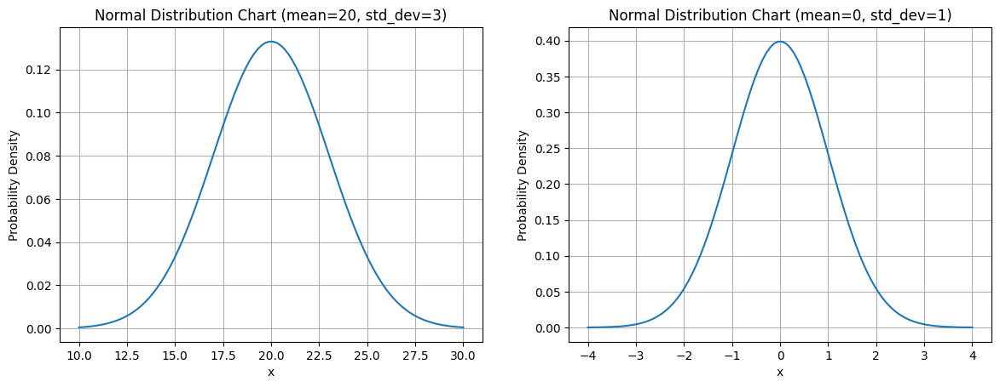

# Normal distribution


**정규 분포(Normal distribution)**는 종 모양의 대칭적인 분포로, 평균과 표준 편차에 의해 결정된다. 특징 몇가지를 적어보자면

* 좌우 대칭형
* 곡선 아래 면적은1
* 양 끝은 0에 도달하지 않음
* 해당 영역의 0.006% 만이 그래프의 가장자리를 벗어남


정규분포는 평균 및 표준편차로 설명된다. 축은 서로 다른 스케일을 가지게된다.



* 평균이 20이고 표준편차가 3인 정규분포
* 평균이 0이고 표준편차가 1인 정규분포: **Standard normal distribution 표준정규분포**


정규분포 생성 코드

```python
import numpy as np
import matplotlib.pyplot as plt

# 데이터 생성
x = np.linspace(10, 30, 100)  # x 값 범위 설정
mean = 20  # 평균
std_dev = 3  # 표준 편차

# 정규 분포의 확률 밀도 함수(PDF) 계산
pdf = (1 / (np.sqrt(2 * np.pi) * std_dev)) * np.exp(-0.5 * ((x - mean) / std_dev) ** 2)

# 정규 분포 차트 그리기
plt.plot(x, pdf)
plt.xlabel('x')
plt.ylabel('Probability Density')
plt.title('Normal Distribution Chart (mean=20, std_dev=3)')
plt.grid(True)
```

Scipy를 사용하면 수식을 작성하지 않아도 된다.

```python
pdf = stats.norm.pdf(x, mean, std_dev)
```


## 68-95-99.7 rule

정규분포의 경우 

* 면적의 68%가 평균에서 ±1 표준 편차 범위에 속한다.
* 면적의 95%가 평균에서 ±2 표준 편차 범위에 속한다.
* 면적의 99.7%가 평균에서 ±3 표준 편차 범위에 속한다.


## 히스토그램은 정규분포와 유사한형태

정규분포는 많은 자연현상이나 데이터에서 나타나는 분포 중 하나이다. 많은 데이터셋에서 데이터 분포가 정규 분포와 유사한 형태를 보이면서 히스토그램의 형태가 종 모양에 가까워지는것을 관찰할 수 있다. 

이는 중심극한정리와 관련이 깊다. 많은 독립적인 확률 변수의 합으로 이루어진 데이터들이 정규분포에 가까워진다.


예를들어 여성의 키에 대한 데이터가 위와같은 정규분포형태로 나온다는 뜻이다. 평균높이는 161cm이며 표준편차는 7cm이다.


여기서 퀴즈를 몇 가지 풀어보자

### 여성의 몇 퍼센트가 154cm보다 작을까?

누적분포함수 cdf를 이용한다.

```python
from scipy.stats import norm
norm.cdf(154, 161, 7)
```

```
0.158655
```

약 16%의 여성이 154cm보다 작다.


### 여성의 90%가 몇 cm보다 작은가?

누적분포역함수 ppf를 이용한다.

```python
norm.ppf(0.9, 161, 7)
```

```
169.97086
```

여성의 90%가 170cm보다 작다.


## Central limit theorem

중심극한 정리의 특징

* 독립적인 확률 변수들의 합은 확률 변수의 개수가 충분히 크다면, 정규분포에 수렴한다.
* 독립적인 확률 변수들의 분포에 상관없이, 평균과 분산이 존재하는 경우에는 합의 분포가 정규분포에 가까워진다.


샘플 데이터가 많으면 많을 수록 정규분포형태에 가까워진다.


**표본을 많이 추출할 수록 정규분포에 가까워짐을 확인했다.**


다음은 주사위를 여러번 던졌을 때 나온 수의 합을 계산하고, 이를 50, 200, 1000번 반복했을 때 나타낸 히스토그램 차트다. 


**루프를 많이 돌 수록 정규분포에 가까워짐을 확인했다.**