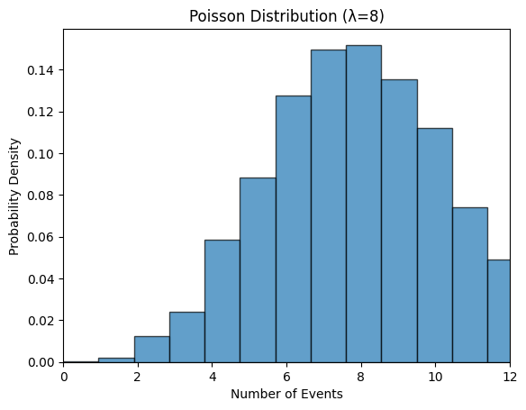
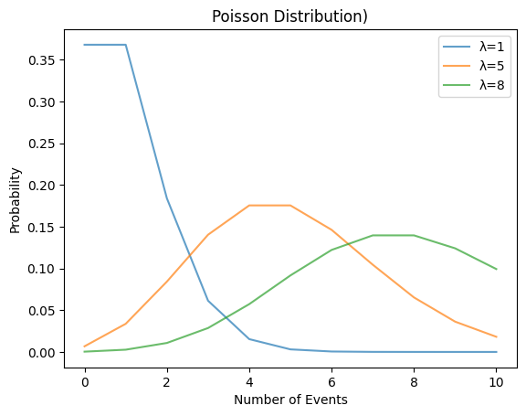

## 푸아송 Poisson processes

푸아송 분포는 이벤트가 일정시간 또는 일정공간에서 발생하는 횟수에 대한 확률분포다. 이벤트가 특정비율의 속도로 발생하는 것처럼 보이지만, 완전히 무작위로 발생하는 프로세스이다. 각 이벤트는 독립적이다.

푸아송의 예로

* 특정 웹사이트에 한 시간동안 방문하는 사람의 수
* 한 주당 입양된 동물의 수
* 매 시간 레스토랑에 도착하는 사람의 수
* 매년 일본에서 일어나는 지진횟수


### Lambda (λ)

λ 는 기간당 평균 이벤트 수이다.

* 동물보호소 예 에서 주당 평균 입양 수는 8이다. λ = 8
* 푸아송 분포의 기댓값을 의미한다.



람다가 8인 프와송분포이다.

아래는 람다에 따라 다른 분포모양을 보이는 그림이다.



어떤 경우에도 분포의 **peak 값은 항상 lambda**에 위치한다.


## 문제

### pmf

주당 평균 입양 횟수가 8명일 때, 한 주에 5번 입양될 확률은??

P(# adoptions in a week = 5)?

```python
from scipy.stats import poisson
poisson.pmf(5, 8)
```

```python
0.09160366
```

9% 확률이다.


### cdf

한 주에 5건 이하일 확률은?

P(# adoptions in a week <= 5)?

```python
poisson.cdf(5, 8)
```

```
0.1912361
```

19%의 확률이다.


### rvs

난수를 생성하여 푸아송 분포에서 샘플을 가져온다.

```python
poisson.rvs(8, size=10)
```

```
array([9, 9, 8, ... ])
```


## The CLT still applies

푸아송 분포도 중심극한정리가 적용된다!.

푸아송 분포의 평균은 표본이 많을 수록 정규화에 가까워진다.