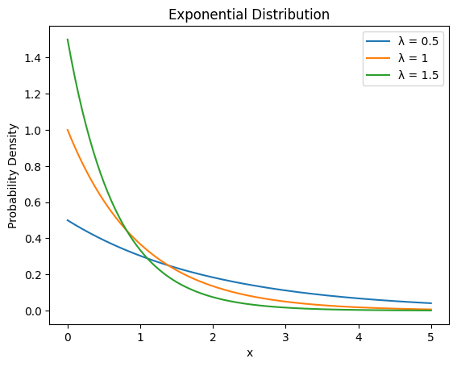
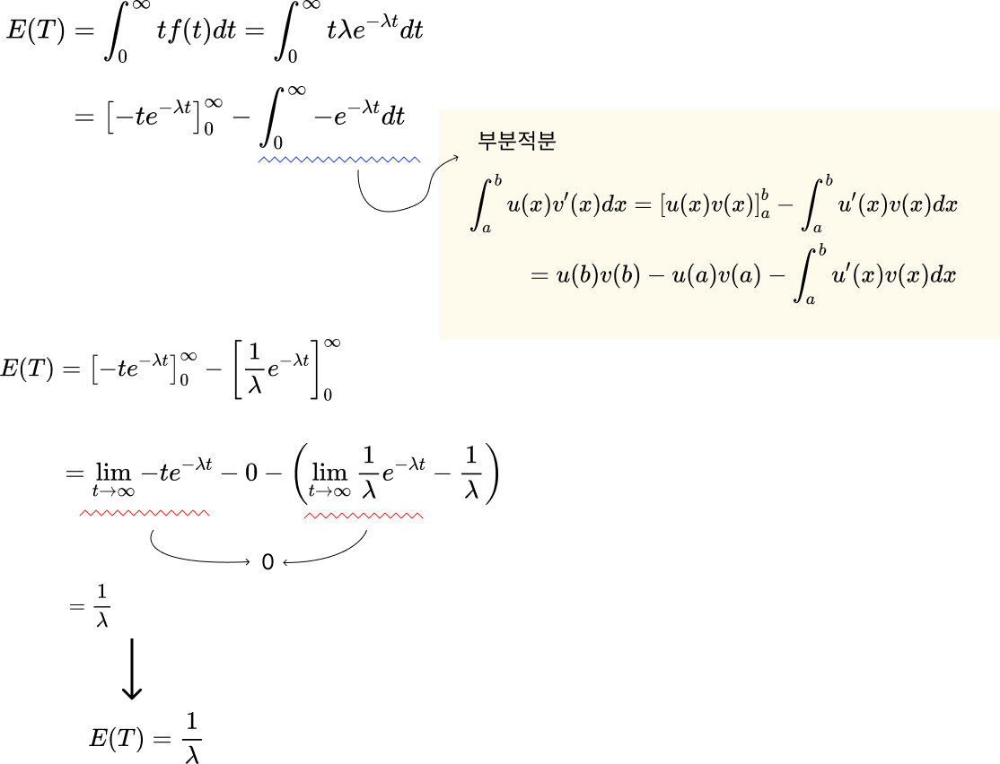
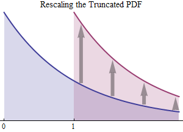
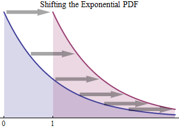

# Exponential distribution

**지수분포**는 연속적인 확률 분포에서, 어떤사건이 특정 시간 또는 공간에 걸쳐서 일어날 확률을 모델링할 때 사용되는 분포다. (푸아송 이벤트 사이에 특정시간이 지나갈 확률)

푸아송은 단위 시간당 발생하는 이벤트 수라면, 지수분포는 한 이벤트가 발생하는데 걸리는 시간에 관심을 둔다.


지수분포를 사용하여 확률을 예측해보자

* 입양일 사이가 1일 이상일 확률
* 레스토랑 도착시간이 10분 미만
* 두 지진 사이에 6~8개월이 지나갈 확률


(x는 0이상)


지수분포는 **동일한 람다 값(상수 취급)**을 사용한다. 

(람다는 사건이 일어나는 평균 빈도를 나타내는 비율. 람다가 크면 사건이 빈번하게 발생한다.)





## 지수분포의 평균과 분산

기대값 E[X]의 정의는 모든 가능한 X값에 대해 X와 X의 확률을 곱한 것의 합이다. 즉 아래 적분식으로 나타낼 수 있다.


### 평균 유도

부분적분과 로피탈의 정리가 사용된다. 



지수분포의 평균은 람다의 역수가 된다.


### 분산 유도

분산을 계산하기 위해서는 지수분포의 평균을 구해야한다. 평균은 람다의 역수가되므로 E[X^2]만 계산하면 된다.


분산은 람다제곱의 역수가 된다.


## 문제

### cdf

새 요청을 1분 미만으로 기다리는 확률은?

P(wait < 1 min) = ??

```python
from scipy.stats import expon
expon.cdf(1, scale=0.5)
```

```
0.8646664
```

86%의 확률


## 무기억 성질

**무기억 성질(Memorylessness)**은 지수분포가 가지는 독특한 특성이다. 무기억 성질은 다음과 같이 정의 된다.

> 지수분포를 따르는 확률변수 X가 있다고 가정하고, t > 0, s > 0인 어떤 값들이 있다.
>
> 그러면 X가 t 시간 후에도 발생하지 않았다면, 그 후 s시간 동알 발생하지 않을 확률은 원래 s시간 동안 발생하지 않은 확률과 동일하다.

수학적으로는 P(X > s + t | X > t) = P(X > s) 이라고 표현 된다.





(면적은 동일).

지수분포는 과거의 상태나 이벤트에 대해 **"기억"하지 않는다.** 이 특성은 지수분포를 특별하게 만드는데, 예들 들어 수명이나 지속 시간과 같이, **얼마나 오래 갈 것인가**에 대한 문제에서 유용하다. 

어떤 시스템있는데

* 시간 t가 지나고 나서도, 그 시스템이 또 다시 어떤시간 s도안 지속될 확률은
* 아무런 시간이 지나지 않았을 때 그 시스템이 s동안 지속될 확률

