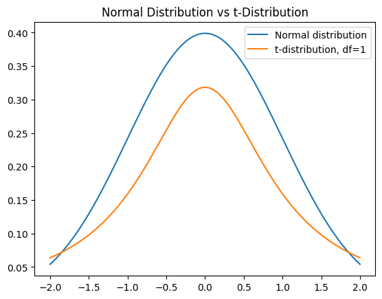
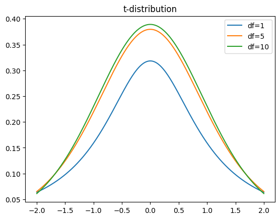

# t-distribution

작은 표본 크기에서 표본 평균을 추정할 때 주로 사용한다. 이 분포는 정규 분포와 비슷하지만, 꼬리 부분이 더 두꺼워서 **이상치에 대해 더욱 강건한 특성**을 가진다.

### 자유도

t-분포에서 **자유도(degree of freedom)**라는 개념이 존재한다. t-분포는 주로 작은 샘플 크기(작은 자유도)를 가진 상황에서 정규 분포를 대신하여 사용된다.

아래는 자유도에 따른 t-분포의 모양이다.

* 자유도가 낮을 수록 꼬리가 두꺼워지고 표준편차가 커진다.
  * 분산도 커진다.
  * 표준편차가 커짐 > 분산도 커짐 > 정규분포는 평평해진다.
* 자유도가 커질 수록 분포는 점점 표준정규분포에 가까워진다.

## 평균과 분산

t-분포의 평균은 0이다. 0을 기준으로 대칭형태의 분포이기 때문이다.

t-분포의 분산은 분포의 자유도에 따라 달라진다. 자유도가 v일 때, 분산의 식은

* v > 2일때, 분산 = v / (v - 2)

