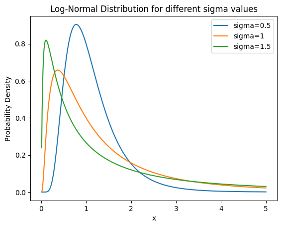

# Log-normal distribution

로그 정규분포(Log-normal distribution)는 어떤 확률변수의 로그가 정규분포를 따를 때, 해당 확률변수의 분포를 의미한다. 이는 값이 항상 양수인 데이터를 모델링할 때 유용하게 사용된다.

로그 정규분포는 몇 가지 특성을 가진다.

* **비대칭** : 모양이 비대칭이다 .보통 오른쪽으로 치우친(Right skewed) 형태를 가진다. 즉, 평균(mean)이 중앙 값(median)보다 크다.
* **양수** : 항상 양수의 값을 갖는 확률변수를 모델링 한다. 실제 세에서 많은 양의 값을 가지는 데이터가 로그 정규분포를 따르는 경향이 있다. 인구, 주가, 생물학적 특성 등등
* **변환** : 곱셈과 나눗셈에 대한 변환에 유용하다. 로그를 취하면 곱셈과 나눗셈이 덧셈과 뺄셈이 된다. 따라서 로그 정규분포는 비율이나 비율의 변화를 측정하는데 유용하다.

## 로그 분포의 평균과 분산

이 식에서 알 수 있는 것은

* **분산의 크기가 크다** : 오른쪽으로 치우친형태이기 때문에 분산의 크기가 크다. 이런 특성때문에 많은 극단적인 값을 포함할 수 있다.
* **양수의 값** : 항상 양수 값을 가지는 확률 변수에 적용된다. 자연로그를 취한 값이 정규분포를 따르기 때문이다.

이 분포를 따르는 실제 사례 몇 가지

* 체스 게임의 길이
* 성인의 혈압
* SAS 발병의 입원 건수