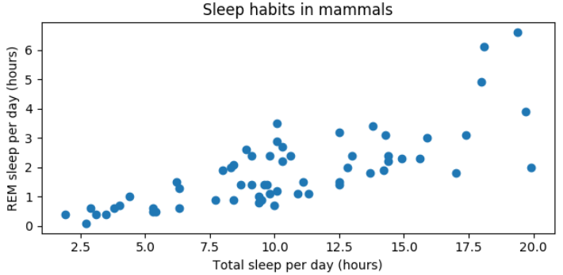
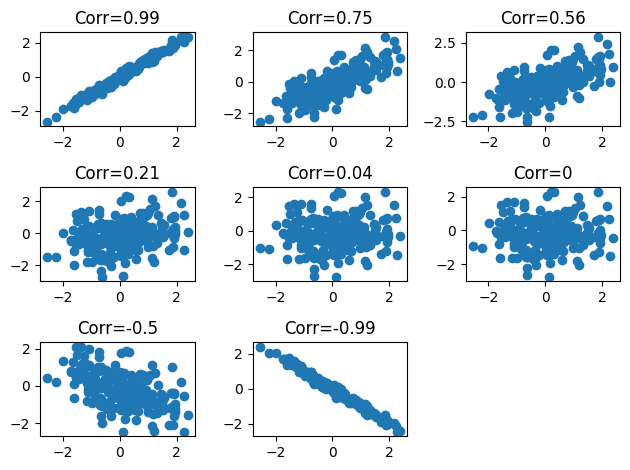
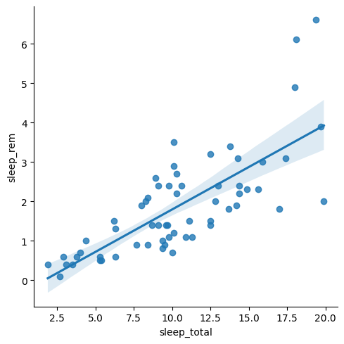

# Correlation

상관관계는 두 변수 간에 어떤 선형적 관계를 가지는지 분석하는 방법이다. 한 변수의 변화가 다른 변수의 변화에 어떤 영향을 미치는지 나타낸다. 이는 두 변수 간 관계의 강도와 방향을 모두 포함하며, 상관계수로 표현된다.

상관계수는 -1부터 1까지의 값을 가진다.


## 산점도

Scatter plot을 이용하여 두 변수 간의 관계를 시각적으로 관찰이 가능하다.



이 산점도에서 포유류가 받는 총 수면량과 그들이 받는 REM 수면량의 관계를 확인할 수 있다.

산점도에서

* x축을 설명변수/독립변수 (explanatory/independent)를
  * x축 변수의 값은 자유롭게 변할 수 있으며, 다른 변수에 영향을 미치는 변수다. 예를 들어 학습시간, 나이, 투자금액 등등.
* y축을 반응변수 /종속변수 (response/dependent)를 나타낸다.
  * y축 변수의 값은 설명변수의 값에 따라 결정되는 변수다. 예를 들어, 시험점수, 생존률, 투자 수익률 등등.


## 상관계수 Correlation coefficient

상관계수를 사용하여 두 변수 간의 관계를 조사할 수 있다.

* Number between -1 and 1
* 크기는 관계의 강도에 해당됨
* 변수와 부호 사이의 양/음수는 관계의 방향에 해당


## Magnitude = strength of relationship



* 수치가 -1과 1에 가까울수록 강한 관계를 가진다. 
* 수치가 0에 가까울수록 관계가 없다.


pandas의 `.corr()`메서드를 사용하면 두 변수 간의 상관관계를 알 수 있다.

```python
correlation1 = df['sleep_total'].corr(df['sleep_rem'])
correlation2 = df['sleep_rem'].corr(df['sleep_total'])
print(correlation1, correlation2)
```

```
0.75, 0.75
```

x와 y의 상관관계가 같기 때문에 같은 결과값을 가진다.


## Visualizing

산점도는 아래

```python
sns.scatterplot(data=df, x='sleep_total', y='sleep_rem')
```


산점도와 추세선을 함께 사용하면 

```python
sns.lmplot(x='sleep_total', y='sleep_rem', data=df, ci=90)
```

* ci옵션은 회귀선 주변의 신뢰구간을 제어한다.
* 데이터에 존재하는 **변동성을 고려** 하여 회귀선이 표현하는 추정치의 불확실성을 나타낸다.
* ci=90인 경우, 90%의 신뢰구간을 의미한다.




## 상관관계 측정방법

상관관계를 측정하는 방법에는 주로 다음 세 가지 방법이 사용된다.

* **피어슨 상관 계수(Pearson's Correlation Coefficient)** : 두 변수 간의 선형관계를 측정한다. 계수는 -1과 1사이의 값을 가지며 -1은 완벽한 음의 선형관계, 1은 완벽한 양의 선형관계, 0은 선형관계가 없음을 나타낸다.
* **스피어만 순위 상관 계수(Spearman's Rank Correlation Coefficient)** : 두 변수의 서열 척도를 측정한다. 이 계수도 -1과 1사이의 값을 가지며, 피어슨 상관관계와 동일하게 해석된다. 스피어만 계수는 두 변수가 모두 순위화 또는 서열화를 할 수 있을 때 유용하다. 실제 값이 아닌 순위에만 의존한다.
* **켄달 타우(Kendall's Tau)** : 두 변수들 간의 순위를 비교하여 **연관성을** 계산한다. 


가장 일반적으로 사용되는 상관 관계측정방법은 피어슨 상관계수다. 다만 피어슨 상관계수는 선형 관계만 측정할 수 있다. 비선형 관계나 순위 관계를 측정하려는 경우는 스피어만 또는 켄달타우 방법을 이용한다.


* x와 y의 평균
* 시그마 x와 시그마 y는 x와 y의 표준편차이다.
* 공식을 암기하는것은 중요하지 않다. 공식을 직접 계산하지 않고 내장함수를 이용하므로..

