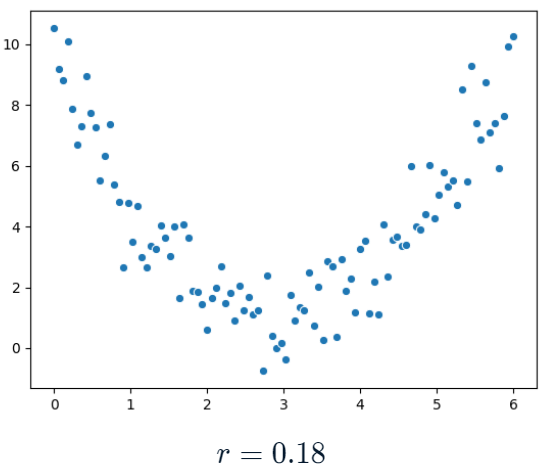
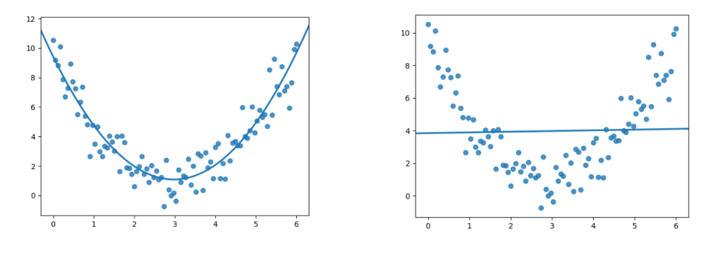
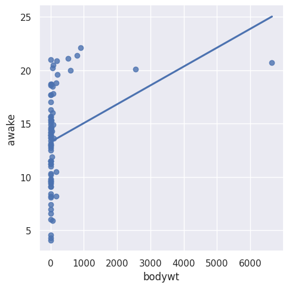
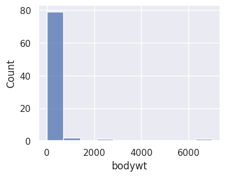
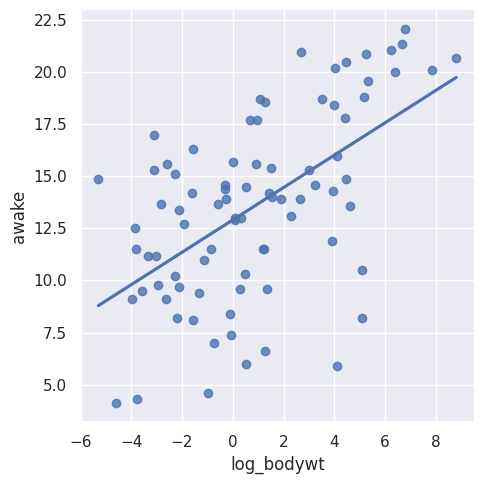

# Correlation caveats

항상 먼제 데이터를 시각화할 것.

다음 상관계수는 x와 y가 선형일때만 구할 것




x와 y 사이에는 분명한 관계가 있다. 상관관계를 계산하면 0.18이된다.



상관관계가 포물선 형태를 보일 때 피어슨 상관계수로는 두 변수 간의 관계를 제대로 측정할 수 없다. 피어슨 상관계수는 두 변수가 선형적으로 어떻게 변하는지를 측정하기 때문이다.


## Log Tranformation

앞에서 설명했지만, 데이터가 한쪽으로 치우친 경우 사용하는 변환방법이다.


```python
correlation = df['bodywt'].corr(df['awake'])
print(f"The correlation between bodywt and awake is {correlation:.2f}")
sns.lmplot(x=a, y=b, data=df, ci=None)
```



```
The correlation between bodywt and awake is 0.31
```


```python
sns.histplot(data=df, x="bodywt", binwidth=700)
```



bodywt의 데이터 분포를 확인해보면 한쪽으로만 심하게 치우쳤다. 이 경우 로그변환을 하면 결과는 어떻게 될까?




훨씬 더 선형적으로 보인다. 체중로그와 각성시간간의 상관관계는


```python
df['log_bodywt'].corr(df['awake'])
```

```
0.5687943427609856
```

로그 변환전의 0.3보다 훨씬 높은 값이다. 약한상관관계에서 보통상관관계로 바뀌었다.