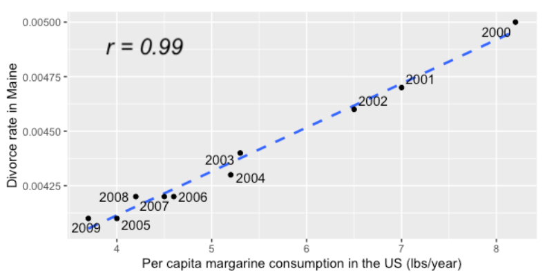
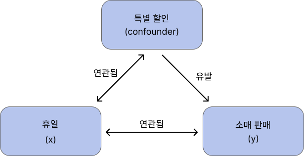

# Spurious correlation

> 상관관계 != 인과관계

"Spurious correlation"는 두 변수 사이에 통계적으로는 유의미한 상관관계를 가지지만, 실제로는 그 관계가 존재하지 않거나, 실제 인과관계가 없는 경우를 가리킨다.

다시말해, x와 y가 상관관계가 있다고하더라도 x가 반드시 y를 유발하지 않는다.

* x축은 US에서 연간 마가린의 소비량
* y축은 이혼률

US에서 마가린의 소비량과 이혼율의 상관관계를 구했더니 0.99로 **완벽한 상관관계**를 가지고 있다.

그러나 마가린을 섭취하는 것이 더 많은 이혼을 유발한다고 할 수 없다. 이런 경우를 "가짜" 또는 "허위" 상관관계라고 부르며, 잘못된 추론을 초래할 수 있다. 

이런 경우는 다음 상황에서 발생한다.

* **일정 패턴을 공유하는 세 번째 변수의 영향** : Confounding Effect라 부르며 아래에 설명.
* **무작위 데이터에서의 상관관계** : 무작위로 뽑은 데이터에 이상치의 유무에 따라 상관계수가 크게 달라질 수 있다.

## Confounding Effect

초기 관찰에서 "커피"를 마시는 것과 "폐암"간의 양의 상관관계가 있음을 발견했다고 가정해보자. 커피를 많이 마시는 사람들은 폐암에 걸릴 확률이 높다는 것이다. 이를 바탕으로 **커피가 폐암을 유발한다** 라는 결론을 내릴 수 있을까? 

이 질문에 답을 하려면, "흡연"이라는 세 번째 숨겨진 변수를 고려해야한다.

1. 흡연은 커피 소비와 관련이 있다.
2. 흡연은 폐암을 유발한다.
3. 커피는 폐암을 유발하지 않지만, 폐암과 연관되어있다.
4. 사실 폐암은 흡연때문에 발생한다.

이것이 커피와 폐암 사이의 관계가 가짜 상관관계임을 의미한다.

또다른 예시로 휴일과 소매 판매간의 관계이다.

"휴일"과 "소매판매"간 양의 상관관계가 있음을 발견했을 때, 휴일이 소매판매를 높인다라는 결론을 내릴 수 있을까? 이 경우는 그럴싸하다.

사실 세 번째 변수로 "특별할인"이 존재한다.

1. 사람들이 휴일마다 소비가 늘어날 수 있지만,
2. 휴일 때문에 판매의 증가를 설명하기에는 어렵다.
3. 휴일에는 특별할인, 프로모션과 같은 금액적인 이유 때문에 판매가 증가한다.

특별거래는 휴일과 판매간을 혼란스럽게 만든다.

